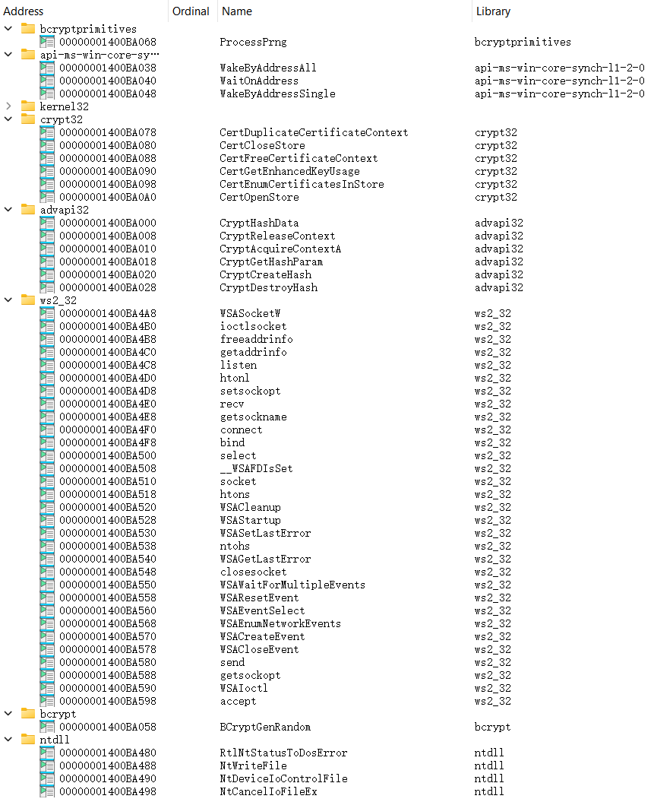

# C++
- [libcurl](https://github.com/curl/curl)
  - [curl-for-win: Reproducible curl binaries for Linux, macOS and Windows](https://github.com/curl/curl-for-win)
    - 即使不开 TLS 也会依赖 crypt32, advapi32, bcrypt

      

  - [cpr: C++ Requests: Curl for People, a spiritual port of Python Requests.](https://github.com/libcpr/cpr)
    - C++17
    - Optional OpenSSL, WinSSL, DarwinSSL, Mbed TLS
    - Async
    - Cookies
    - Compression: [compress transfer failed - Issue #211 - libcpr/cpr](https://github.com/libcpr/cpr/issues/211)
  - [jpbarrette/curlpp: C++ wrapper around libcURL](https://github.com/jpbarrette/curlpp)
  - [JosephP91/curlcpp: An object oriented C++ wrapper for CURL (libcurl)](https://github.com/JosephP91/curlcpp) (inactive)
  - [liblifthttp: Safe and easy to use C++17 HTTP client library.](https://github.com/jbaldwin/liblifthttp)
  - [restclient-cpp: C++ client for making HTTP/REST requests](https://github.com/mrtazz/restclient-cpp)

  [Linking to curlcpp (a C++ curl wrapper) - Code - CMake Discourse](https://discourse.cmake.org/t/linking-to-curlcpp-a-c-curl-wrapper/5677)

  [IbUpdateLib/C++](https://github.com/Chaoses-Ib/IbUpdateLib/tree/main/C%2B%2B)

- [cpp-httplib: A C++ header-only HTTP/HTTPS server and client library](https://github.com/yhirose/cpp-httplib)
  - Mainly for server
  - C++11
  - Optional OpenSSL
    - [enable winssl instead of using big openssl libraries for windows - Issue #1853 - yhirose/cpp-httplib](https://github.com/yhirose/cpp-httplib/issues/1853)
  - URL base
  - No built-in cookies support

- [Boost.Beast: HTTP and WebSocket built on Boost.Asio in C++11](https://github.com/boostorg/beast)
  - Optional OpenSSL
  - [Belle: An HTTP / Websocket library in C++17 using Boost.Beast and Boost.ASIO.](https://github.com/octobanana/belle)
  - [BeastHttp: Provides helper tools for creating RESTful services using Boost.Beast](https://github.com/0xdead4ead/BeastHttp) (discontinued)

- [nativeformat/NFHTTP: A cross platform C++ HTTP library that interfaces natively to other platforms.](https://github.com/nativeformat/NFHTTP) ([Hakcer News](https://news.ycombinator.com/item?id=19541924))
  - No vcpkg

- [microsoft/cpprestsdk: The C++ REST SDK is a Microsoft project for cloud-based client-server communication in native code using a modern asynchronous C++ API design. This project aims to help C++ developers connect to and interact with services.](https://github.com/microsoft/cpprestsdk) (discontinued)

- [Sony/EasyHttp: A cross-platform HTTP client library with a focus on usability and speed](https://github.com/sony/easyhttpcpp) (discontinued)

- [Kicer86/cpp\_restapi: Rest API library for c++](https://github.com/Kicer86/cpp_restapi)
  - Qt / libcurl / cpp-httplib

- Qt

- [QHttp: a light-weight and asynchronous HTTP library (both server & client) in Qt5 and c++14](https://github.com/azadkuh/qhttp) (discontinued)

- [cpp-netlib: The C++ Network Library Project -- cross-platform, standards compliant networking library.](https://github.com/cpp-netlib/cpp-netlib)

- [Qihoo360/evpp: A modern C++ network library for developing high performance network services in TCP/UDP/HTTP protocols.](https://github.com/Qihoo360/evpp)

Embedded:
- [FreeRTOS/coreHTTP: Client implementation of a subset of HTTP 1.1 protocol designed for embedded devices.](https://github.com/FreeRTOS/coreHTTP)
- [httpc: HTTP client for embedded use - supports redirects and resume.](https://github.com/howerj/httpc)

Windows:
- [microsoft/WinHttpPAL: WinHttpPAL is a C++ library which implements WinHttp API for POSIX systems using libcurl](https://github.com/microsoft/WinHttpPAL)
- [ericroy/winhttp: C++ wrapper around the WinHTTP library](https://github.com/ericroy/winhttp) (discontinued)
- Kernel
  - [WskHttp: Windows kernel drivers simple HTTP library for modern C++](https://github.com/zhuhuibeishadiao/WskHttp)

Discussions:
- 2021-11 [Suggestions for a minimal and simple http client library? : r/cpp\_questions](https://www.reddit.com/r/cpp_questions/comments/qlf9yo/suggestions_for_a_minimal_and_simple_http_client/)

[fffaraz/awesome-cpp: A curated list of awesome C++ (or C) frameworks, libraries, resources, and shiny things. Inspired by awesome-... stuff.](https://github.com/fffaraz/awesome-cpp#networking)

[libcurl - available alternatives](https://curl.se/libcurl/competitors.html)