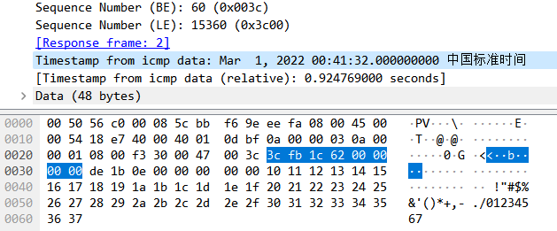
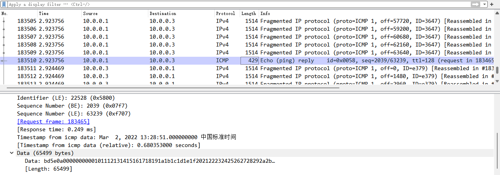
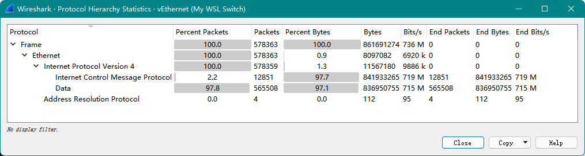

# Echo and Echo Reply
```
0                   1                   2                   3
0 1 2 3 4 5 6 7 8 9 0 1 2 3 4 5 6 7 8 9 0 1 2 3 4 5 6 7 8 9 0 1
+-+-+-+-+-+-+-+-+-+-+-+-+-+-+-+-+-+-+-+-+-+-+-+-+-+-+-+-+-+-+-+-+
|     8/0       |      0        |          Checksum             |
+-+-+-+-+-+-+-+-+-+-+-+-+-+-+-+-+-+-+-+-+-+-+-+-+-+-+-+-+-+-+-+-+
|           Identifier          |        Sequence Number        |
+-+-+-+-+-+-+-+-+-+-+-+-+-+-+-+-+-+-+-+-+-+-+-+-+-+-+-+-+-+-+-+-+
|     Data ...
+-+-+-+-+-
```
- Identifier
  
  If code = 0, an identifier to aid in matching echos and replies, may be zero.
- Sequence Number
  
  If code = 0, a sequence number to aid in matching echos and replies, may be zero.
- Description
  
  The data received in the echo message must be returned in the echo reply message.

## ping
ping 是用于测试 IP 网络中主机可达性的网络管理工具，在绝大多数具有网络能力的操作系统上都可用。ping 的实现原理是通过向目标主机发送 ICMP echo 请求数据包，并等待 ICMP echo 响应，从而测量出 round trip time。因为实现原理与主动声纳相似，便取声纳的声音“ping”作为该工具的名字。[^ping-wiki]

Implementations:
- [linux/ping.c](https://github.com/torvalds/linux/blob/master/net/ipv4/ping.c)
- [iputils/ping.c](https://github.com/iputils/iputils/blob/master/ping/ping.c)

Linux (iputils) | Windows
--- | ---
 | 

- 为什么 Linux ping 会有 Timestamp？  
  如果是作为 data 的一部分的话，Wireshark 又是怎么识别出来的？
- Linux ping 时间戳后面的 4 个字节又是什么？

  根据 iputils 的源码，timeval 在 x64 上是 16 字节，包括 `tv_sec` 和 `tv_usec`，但是 Wireshark 没有识别出 `tv_usec`。实际的 padding data 应该从 `10 11 12 13` 开始。
- 指定更长的 data 尺寸的话，ping 会填充什么？
  - Linux：到达 ff 后，00\~ff 循环（实际上就是完全 00\~ff 循环，只不过第一组会被 timeval 覆盖）
  - Windows：a\~w 循环

通过 ping 数据包可以推测出来源机器是 Windows 还是 Linux，如果是 Linux，系统位数是 32 位还是 64 位。

## Ping of death
A **ping of death** is a type of attack on a computer system that involves sending a malformed or otherwise malicious ping to a computer.

A correctly formed ping packet is typically 56 bytes in size, or 64 bytes when the ICMP header is considered, and 84 bytes including IPv4 header. However, any IPv4 packet (including pings) may be as large as 65,535 bytes. Some computer systems were never designed to properly handle a ping packet larger than the maximum packet size because it violates the Internet Protocol. Like other large but well-formed packets, a ping of death is fragmented into groups of 8 octets before transmission. However, when the target computer reassembles the malformed packet, a buffer overflow can occur, causing a system crash and potentially allowing the injection of malicious code.

In early implementations of TCP/IP, this bug is easy to exploit and can affect a wide variety of systems including Unix, Linux, Mac, Windows, and peripheral devices. As systems began filtering out pings of death through firewalls and other detection methods, a different kind of ping attack known as ping flooding later appeared.[^death-wiki]

## Ping flood attack
ping flood attack 是一种简单的 denial-of-service 攻击，正如名字所表达的，它的原理就是向目标主机发送大量的 Echo Request 包，从而消耗目标主机的上下行带宽，造成服务瘫痪。[^flood-wiki]

ping flood attack 可简单地通过 iputils 实现，例如：
```sh
sudo ping -f -s 65507 10.0.0.1
```
（出于安全考虑，iputils 限制了进行 flood 测试的权限要求，因此需要 sudo）





在测试环境中 `ping -f -s 65507` 达到了 736 Mb/s 的攻击流量，接近 100 MB/s 的带宽上限。


[^ping-wiki]: [ping (networking utility) - Wikipedia](https://en.wikipedia.org/wiki/Ping_(networking_utility))
[^death-wiki]: [Ping of death - Wikipedia](https://en.wikipedia.org/wiki/Ping_of_death)
[^flood-wiki]: [Ping flood - Wikipedia](https://en.wikipedia.org/wiki/Ping_flood)