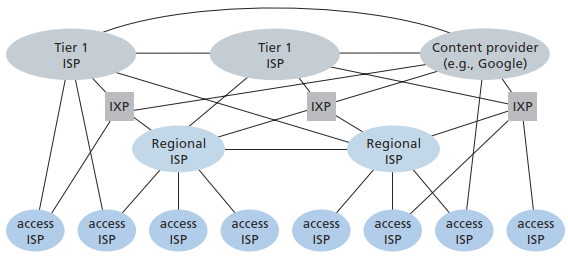

# Internet Service Providers
[^topdown]
- Points of presence: A PoP is simply a group of one or more routers (at the same location) in the provider’s network where customer ISPs can connect into the provider ISP.
- Multi-homing: Connecting to two or more provider ISPs.
- Peering: A pair of nearby ISPs directly connect their networks together.
- Internet exchange point: A meeting point where multiple ISPs can peer together.

[^topdown]: *Computer Networking: A Top-Down Approach*

[个人 Blog，1MB 的带宽够用么？ - V2EX](https://www.v2ex.com/t/145711)
> 一般来讲1wpv以内，图片用外链，1mbps只有高峰期略卡，再多就不知道了

## ISPs in different regions
### Mainland China
[^china-sjlleo]
- China Telecom (CT, 中国电信)
  - CTGNet (AS23764)
    - CTGNet Global Internet Access (CTGNet GIA)
  - ChinaNet Next Carrying Network (CN2, AS4809)
    - CN2 Global Internet Access (CN2 GIA)
    - CN2 Global Transfer (CN2 GT)
  - China Telecom Backbone (163 骨干网, AS4134)
- China Unicom (CU, 中国联通)
  - China Unicom Global (CUG, AS10099)
  - China Unicom Industrial Internet Backbone (A网, AS9929)
  - China Unicom Backbone (169 骨干网, AS4837)
- China Mobile (CM, 中国移动)
  - China Mobile International (CMI, AS58453)
    - China Mobile Commercial Broadband (CMCB)
    - CMIN2 (AS58807)
      - 2022-09 [移动精品网 CMIN2 AS58807 的国际出口开通了 - V2EX](https://www.v2ex.com/t/877962)
      - 2024-11 [CMI给所有普通线路晚高峰安排了QOS-美国VPS综合讨论-全球主机交流论坛 - Powered by Discuz!](https://hostloc.com/thread-1363904-1-1.html)
      - 2024-11 [晚高峰的移动，非CMIN2的小鸡完全没法用了，单线程全部低于20Mbps](https://www.nodeseek.com/post-195648-1)
      - 2024-12 [dmit lax cmin2 晚高峰广东移动单线程大概能跑多少？](https://www.nodeseek.com/post-231423-1)
  - China Mobile (AS9808)
- China Education and Research Network (CERNET, 教育网, AS4538)
- China Science and Technology Network (CSTNET, 科技网, AS7497)

Quality: CN2 GIA > CMIN2 (AS58807) > CUII Backbone (AS9929) > CMI (AS58453) > CU Backbone (AS4837) > CN2 GT > CT Backbone (AS4134) [^china-quality]

Discussions:
- 2023-08 [【求科普】有没有老哥科普下各个线路](https://www.nodeseek.com/post-20083-1)

  > 就说美西，GIA $8000/Gbps，9929 $6000/Gbps，CMI $4000/Gbps，4837 $2000/Gbps，你看看商家卖价多少，宽带标的多少，算一下就知道超售比例了。

  > 这东西都有时效性的 不好说  
  > 比如4837只是联通的普通线路 但是刚出来时候因为人少 用起来和9929没多大差别  
  > 现在知道的人多了都往里面去 质量自然就开始降低了  
  > CMI也和4837一样的道理 赢在路宽车少  
  > 剩下的cn2 cmin2这些官方自己定位为精品线路的 赢在车少的同时还有个优先通行buff  
  > 9929虽说也是精品线路吧 不过我电信用起来感觉和这俩还是有点差距 也不排除自己用的这家超售多了  
  > 
  > cera和qn这些上游也是时效性 没准就是今天这家拔线了 明天那家线路被挖了

- 2023-12 [只要不超售，4837/9929/cmi跟gia没什么差距-美国VPS综合讨论-全球主机交流论坛 - Powered by Discuz!](https://hostloc.com/thread-1246889-1-1.html)
- 2024-05 [CN2-GIA和9929差多少？](https://www.nodeseek.com/post-113127-1)

  > 跨网存在被qos的情况，一般用自家精品网是最优解，况且AS9929是老网，跨网测评也稀少，电信一般情况下还是用自家CN2GIA最好
  > 
  > AS9929目前联通晚高峰使用仍然是强于CMIN2和CN2GIA的，并且它只是老网，仅仅是签约单价比较高，所以拥堵程度要好很多
  > 
  > 至少联通网络下无论是晚高峰还是非高峰期，CN2GIA的单线程都跑不过CMIN2，并且同样是跨网，对比也相对公平
  > 
  > 4837晚高峰稳定性较差、丢包率较高，并且它也不是被作为精品线路来卖的，签约单价很大程度上会决定线路的拥堵程度  
  > 而CMIN2和CN2GIA都是被作为精品线路来卖的，签约单价都比较高，晚高峰的稳定性也是难分伯仲的，至于长时间考验线路这个确实没办法，CMIN2毕竟是新出来对标CN2GIA的，但终究是拿来和CN2GIA竞争的，移动也没理由糟蹋这线路，只能说CN2GIA还是以前霸主当太久了，认知的改变是需要时间的

[^china-quality]: [CN2 GIA＞AS9929＞CN2 GT＞AS4837,这个排名靠谱吗 - 全球主机交流论坛](https://hostloc.com/thread-953685-1-1.html)

#### 家宽
[家宽建站的几种方式](https://www.opshub.cn/2023-08-23/family-network-336.html)

- 2023-06 [家宽建站方案 - V2EX](https://www.v2ex.com/t/950624)
- 2023-07 [家宽套cdn建站可行性](https://www.nodeseek.com/post-14238-1)
- 2023-11 [家里联通宽带部署服务 套 cloudflare 的 CDN 然后路由器防火墙里选择只能 cf 的 ip 入站 会不会安全些 - V2EX](https://v2ex.com/t/991153)

### Hong Kong, China
- CMI (AS58453)
- CUG (AS10099)
- NTT
- HKT (香港电讯)
- HKBN (香港频宽)
- PCCW
- Telstra
- CHT

Quality[^china-sjlleo]:
- CT Backbone (AS4134): CUG > CMI > Telstra > others
- CU Backbone (AS4837): CUG > CMI > PCCW > CHT > HKBN/WTT > HKT > others
- CMI (AS58453): CMI > CUG > SingTel > HKIX > NTT > HKBN/WTT > others

### Taiwan, China
- Chunghwa Telecom (CHT)

### Japan
- NTT
- BBTEC (SoftBank)
- IIJ
- KDDI

## Servers
Name | 混合拨号
--- | ---
[91VPS](https://www.91vps.com/) | ✔️
[纵横数据 动态拨号VPS服务器](https://www.zndata.com/dtvps/103.html) | ✔️
[拨号云 动态拨号VPS](https://www.bohaovps.com/product/bohaovps.html) | ✔️
[蚂蚁VPS](https://www.mayivps.com/) | ✔️
[米安网络](https://www.miandns.com/) | ✔️
[飞网](https://www.fwvps.com/) | ✔️

或者任何按量计费的 VPS、IP（弹性公网IP）：
- 天翼云
  
  一个服务器只能绑20条线

  [24年7月最新IP搭建教程，配合一键脚本，5分钟轻松学会，300MB独享网速 - 哔哩哔哩](https://www.bilibili.com/video/BV1Zm421V7Ve)

- 阿里云

[^china-sjlleo]: [sjlleo/local-ISPs-to-CN: Network connectivity between your local ISPs and China / 您的本地运营商和中国的网络互联情况](https://github.com/sjlleo/local-ISPs-to-CN/blob/main/report_zh_CN.md) ([国内至国际骨干Tier1 ISPs线路整理（2022年更新篇） - 知乎](https://zhuanlan.zhihu.com/p/451683996))