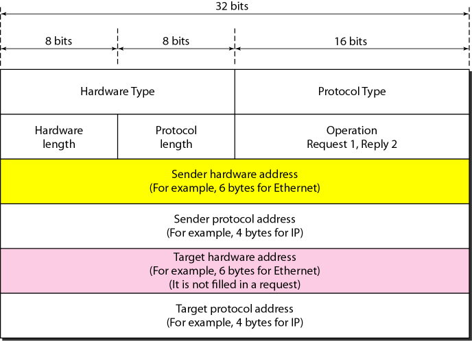

# Address Resolution Protocol
ARP：IP address → MAC address

每个 host 都有一个 ARP table，要发送包时，sender 首先会尝试从 ARP table 获取对应的 MAC 地址。当获取不到时，sender 会通过 broadcast MAC address 发送 ARP query 询问子网中的所有其它 host。

[RFC 826 - An Ethernet Address Resolution Protocol: Or Converting Network Protocol Addresses to 48.bit Ethernet Address for Transmission on Ethernet Hardware](https://datatracker.ietf.org/doc/html/rfc826)

## Packet structure


## [ARP spoofing](https://en.wikipedia.org/wiki/ARP_spoofing)
**ARP spoofing (ARP cache poisoning, ARP poison routing)** is a technique by which an attacker sends (spoofed) ARP messages onto a local area network.

ARP is a stateless protocol. Network hosts will automatically cache any ARP replies they receive, regardless of whether network hosts requested them. Even ARP entries that have not yet expired will be overwritten when a new ARP reply packet is received. There is no method in the ARP protocol by which a host can authenticate the peer from which the packet originated. This behavior is the vulnerability that allows ARP spoofing to occur.

Generally, the aim is to associate the attacker's MAC address with the IP address of another host, such as the default gateway, causing any traffic meant for that IP address to be sent to the attacker instead.

### Defenses
- Static ARP entries

  Windows:
  ```cmd
  arp -s 157.55.85.212 00-aa-00-62-c6-09
  ```
- Detection and prevention software
- OS security
  Operating systems react differently:
  - Linux ignores unsolicited replies, but, on the other hand, uses responses to requests from other machines to update its cache.
  
    可通过 `/proc/sys/net/ipv4/conf/*/arp_accept` 进行设置。[^linux-so]
  - Solaris accepts updates on entries only after a timeout.
  - In Microsoft Windows, the behavior of the ARP cache can be configured through several registry entries under `HKEY_LOCAL_MACHINE\SYSTEM\CurrentControlSet\Services\Tcpip\Parameters`, `ArpCacheLife`, `ArpCacheMinReferenceLife`, `ArpUseEtherSNAP`, `ArpTRSingleRoute`, `ArpAlwaysSourceRoute`, `ArpRetryCount`.

[^linux-so]: [c - using libnet to send ARP request, but arp cache won't update after getting the ARP reply - Stack Overflow](https://stackoverflow.com/questions/3359588/using-libnet-to-send-arp-request-but-arp-cache-wont-update-after-getting-the-a)