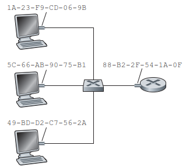

# Link-layer Address
A link-layer address is variously called a LAN address, a physical address, or a MAC address. Unlike IP addresses, link-layer addresses are tied with adapters and still unchanged if the hosts are moved.[^topdown]

IP 与 link-layer address 的关系类似于住址与身份证号的关系，两者都有存在的必要：
- 首先，这样可以解耦，允许网络层使用 IP 之外的协议，比如 IPX 和 DECnet
- 其次，这样 adapter 就不需要动态配置地址了，实现更为简单
  尽管也可以选择让网络层对包地址进行过滤，但这样做性能就相对差些

大多数 link-layer address 是六个字节，这样就有足够的地址空间来保证没有任何两个 adapter 的 address 是相同的。

broadcast address 是 FF-FF-FF-FF-FF-FF。

[^topdown]: Computer Networking：A Top-Down Approach