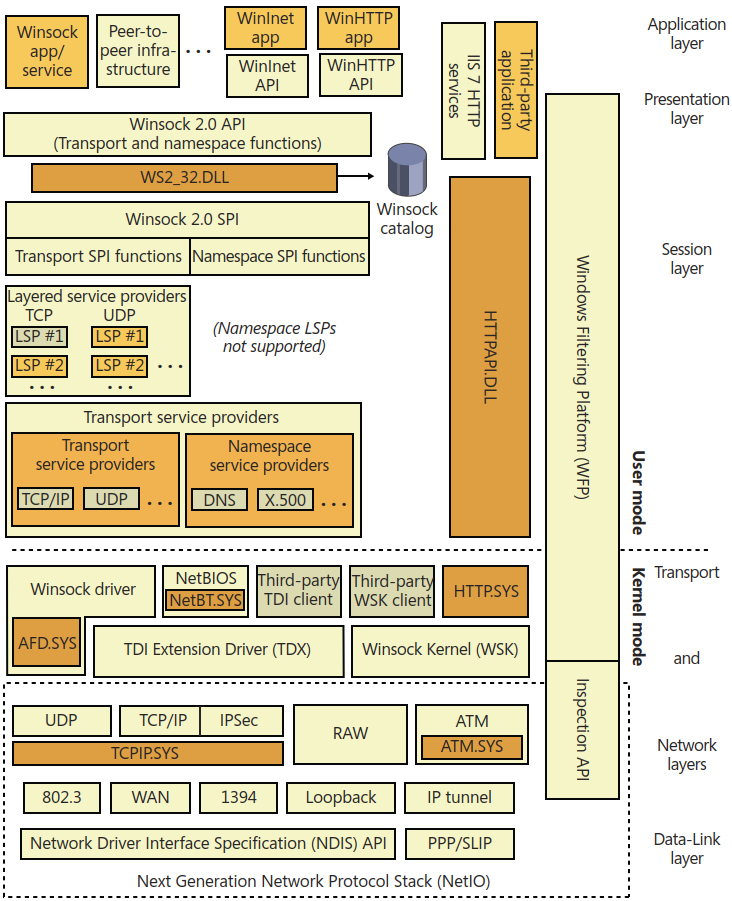

# Windows
[^winter]

[portforwarding - NETSH port forwarding from local port to local port not working - Stack Overflow](https://stackoverflow.com/questions/24646165/netsh-port-forwarding-from-local-port-to-local-port-not-working)

["netsh interface portproxy" doesn't work - Microsoft Q&A](https://learn.microsoft.com/en-us/answers/questions/189038/netsh-interface-portproxy-doesnt-work)

## epoll
- [wepoll: fast epoll for windows 🎭](https://github.com/piscisaureus/wepoll)

[^winter]: Windows Internals v6