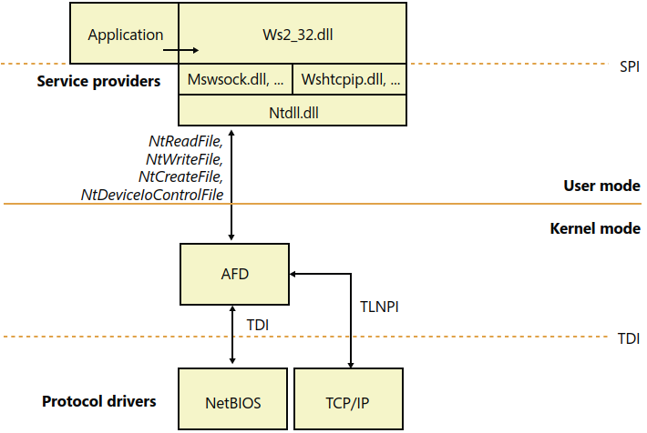

# Windows Sockets (Winsock)
[Windows Sockets 2 - Win32 apps | Microsoft Learn](https://learn.microsoft.com/en-us/windows/win32/winsock/windows-sockets-start-page-2)

[^winter]

## AFD.SYS
[Recon2015-20 Steven Vittitoe Reverse Engineering Windows AFD.sys](https://recon.cx/2015/slides/recon2015-20-steven-vittitoe-Reverse-Engineering-Windows-AFD-sys.pdf)

### Vulnerabilities
- CVE-2014-1767 (MS14-040)
  
  [windows-kernel-exploits/MS14-040](https://github.com/SecWiki/windows-kernel-exploits/blob/master/MS14-040/README.md)

  [\[原创\] 凑个热闹： CVE-2014-1767 分析报告](https://github.com/CrackerCat/simpread/blob/e51f798a516c348f5abfeda1e197780275f66edd/md/%5B%E5%8E%9F%E5%88%9B%5D%20%E5%87%91%E4%B8%AA%E7%83%AD%E9%97%B9%EF%BC%9A%20CVE-2014-1767%20%E5%88%86%E6%9E%90%E6%8A%A5%E5%91%8A.md)

- CVE-2023-21768

  [Patch Tuesday -> Exploit Wednesday: Pwning Windows Ancillary Function Driver for WinSock (afd.sys) in 24 Hours](https://securityintelligence.com/x-force/patch-tuesday-exploit-wednesday-pwning-windows-ancillary-function-driver-winsock/)

  [Ha0-Y/CVE-2023-21768](https://github.com/Ha0-Y/CVE-2023-21768/blob/cb62f87ceb3bc19ebb426e0863fb5ded2bb22f8a/CVE-2023-21768.md)

## Winsock Kernel (WSK)
[Introduction to Winsock Kernel - Windows drivers | Microsoft Learn](https://learn.microsoft.com/en-us/windows-hardware/drivers/network/introduction-to-winsock-kernel)

[Network Subsystem Performance Tuning | Microsoft Learn](https://learn.microsoft.com/en-us/previous-versions/windows/it-pro/windows-server-2012-r2-and-2012/jj574169(v=ws.11))
> The WSK interface was introduced in Windows Server® 2008 and Windows Vista, and it is exposed by AFD.sys. The interface improves performance by eliminating the switching between user mode and kernel mode.

- [MiroKaku/libwsk: The Kernel-Mode Winsock library, supporting TCP, UDP and Unix sockets (DGRAM and STREAM).](https://github.com/MiroKaku/libwsk)
- [wbenny/KSOCKET: KSOCKET provides a very basic example how to make a network connections in the Windows Driver by using WSK](https://github.com/wbenny/KSOCKET) (discontinued)
  - [mingw-w64-ksocket: Windows Kernel <-> User mode socket communication made for "Mingw64 Driver Plus Plus".](https://github.com/utoni/mingw-w64-ksocket)

Rust:
- [hussein-aitlahcen/windows-kernel-rs: Windows Kernel Driver library for Rust developers](https://github.com/hussein-aitlahcen/windows-kernel-rs) (discontinued)
- [carlos-al/windows-kernel-rs](https://github.com/carlos-al/windows-kernel-rs)

## AFD
[`\Device\Afd`, or, the Deal with the Devil that makes async Rust work on Windows -- notgull -- The world's number one source of notgull](https://notgull.net/device-afd/)

Wine: v6.11+
- [mio (and tokio) sockets are completely broken under wine - Issue #1444 - tokio-rs/mio](https://github.com/tokio-rs/mio/issues/1444#issuecomment-867685922)

C++:
- [NtSocket\_NtClient\_NtServer: Using NtCreateFile and NtDeviceIoControlFile to realize the function of winsock（利用NtCreateFile和NtDeviceIoControlFile 实现winsock的功能）](https://github.com/A-Normal-User/NtSocket_NtClient_NtServer)
- [x86matthew - NTSockets - Downloading a file via HTTP using the NtCreateFile and NtDeviceIoControlFile syscalls](https://www.x86matthew.com/view_post?id=ntsockets)
- [lib-nosa: a minimalist C library designed to facilitate socket connections through AFD driver IOCTL operations on Windows.](https://github.com/ViperXSecurity/lib-nosa)
- [R41N3RZUF477/NtSock](https://github.com/R41N3RZUF477/NtSock)
- [libuv: Cross-platform asynchronous I/O](https://github.com/libuv/libuv)
  - Node.js
- [wepoll: fast epoll for windows 🎭](https://github.com/piscisaureus/wepoll)

Rust:
- [Mio: Metal I/O library for Rust.](https://github.com/tokio-rs/mio)
  - Tokio
- [polling: Portable interface to epoll, kqueue, event ports, and wepoll](https://github.com/smol-rs/polling)
  - > Previously, this crate used the `wepoll` library for polling. `wepoll` uses a similar AFD-based strategy for polling.
  - Used by smol, async-std

## Windows Sockets 2
Windows Sockets 2 (Winsocck 2, `Ws2_32.dll`)

[Windows Sockets 2 - Win32 apps | Microsoft Learn](https://learn.microsoft.com/en-us/windows/win32/winsock/windows-sockets-start-page-2)

[wine/dlls/ws2\_32/socket.c at master - wine-mirror/wine](https://github.com/wine-mirror/wine/blob/master/dlls/ws2_32/socket.c)

[szdani/winsock-playground: C++ Client Server code for Winsock "fun"](https://github.com/szdani/winsock-playground)

## Processes
[Does Windows take care of closing sockets when processes exit? - Super User](https://superuser.com/questions/375604/does-windows-take-care-of-closing-sockets-when-processes-exit)

### Handle inheritance
[`CreateProcess`](https://learn.microsoft.com/en-us/windows/win32/api/processthreadsapi/nf-processthreadsapi-createprocessa) with `bInheritHandles` set to `TRUE` will inherit the sockets of the parent process.
- But the inherited sockets are not visible in the handle list and the socket list of the child process.
- For `netstat`, the sockets are listed under the PID of the parent process, with the name "System" if the parent process died.

[How do you free up a port being held open by dead process? - Server Fault](https://serverfault.com/questions/181015/how-do-you-free-up-a-port-being-held-open-by-dead-process)
> What may be happening is that your process had a TCP port open when it crashed or otherwise exited without explicitly closing it. Normally the OS cleans up these sorts of things, but only when the process record goes away. While the process may not appear to be running any more, there is at least one thing that can keep a record of it around, in order to prevent reuse of its PID. This is the existence of a child process that is not detached from the parent.
>
> If your program spawned any processes while it was running, try killing them. That should cause its process record to be freed and the TCP port to be cleaned up. Apparently windows does this when the record is released not when the process exits as I would have expected.

[→Handle inheritance](https://github.com/Chaoses-Ib/Windows/blob/main/Kernel/Objects/README.md#handle-inheritance)

[^winter]: Windows Internals v6