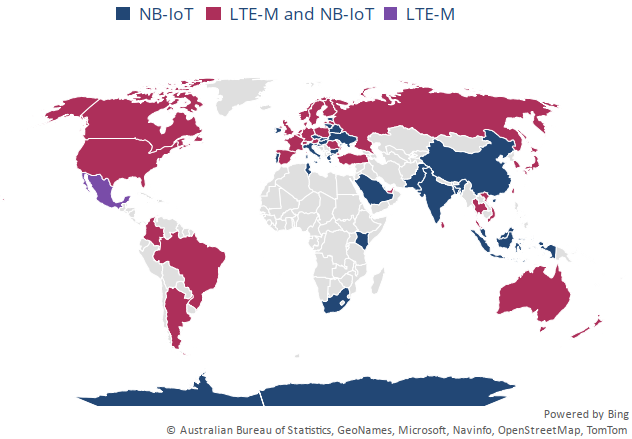
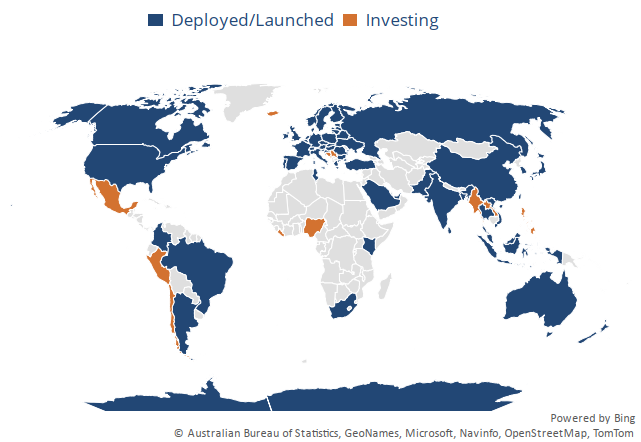
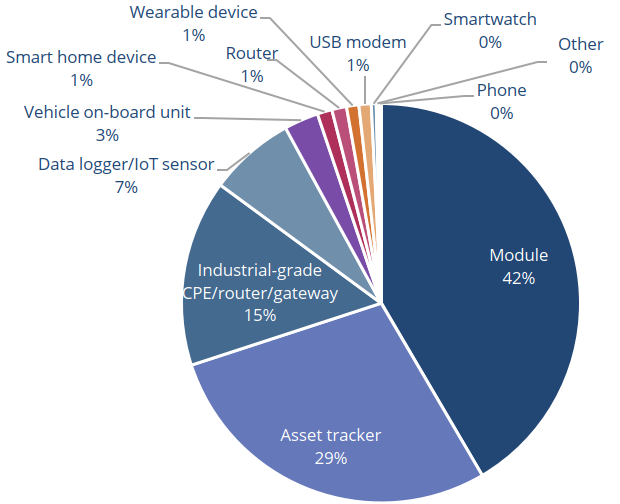

# Narrowband Internet of Things
[Wikipedia](https://en.wikipedia.org/wiki/Narrowband_IoT)

NB-IoT uses a subset of the LTE standard, but limits the bandwidth to a single narrow-band of 200kHz.

据 GSA（全球移动供应商协会）统计，截至 2023 年 3 月：
- 180 家运营商在 81 个国家部署或启动了 NB-IoT 或 LTE-M 网络
- 168 家运营商积极投资于 NB-IoT 技术，其中：
  - 125 家已经部署或商业化推出 NB-IoT 网络
  - 24 家正在规划、试点或部署 NB-IoT 网络
  - 19 家正在评估或试用 NB-IoT 技术
- 76 家运营商积极投资于 LTE-M 技术，其中：
  - 56 家已部署或商业化推出 LTE-M 网络
  - 11 家正在规划、试点或部署 LTE-M 网络
  - 9 家正在试用 LTE-M 技术

Countries with deployed or launched NB-IoT and LTE-M networks:

Status of investment in NB-IoT networks by country:

## Applications
[NB1 vs. NB2 complete comparison table and overview | Haltian](https://haltian.com/resource/nb1-vs-nb2-complete-comparison-table-and-overview/)

Cat-NB1 device models by form factor (total: 503):

- 模块
- 资产追踪器
- 工业级 CPE（客户前置设备）/路由器/网关

  CPE（Customer Premise Equipment，客户前置设备）是一种接收移动信号并以无线 Wi-Fi 信号转发出来的移动信号接入设备。

- 数据记录器/物联网传感器
- 车载单元
- 智能家居设备
- 路由器
- 可穿戴设备
- USB 调制解调器
- 智能手表
- 其他
- 电话

[GSMA | NB-IoT Commercialisation Case Study: How China Mobile, China Telecom & China Unicom Enable Million More IoT Devices | NB-IoT商业化案例研究：中国移动、中国电信和中国联通 如何支持数千万物联网设备 | Internet of Things](https://www.gsma.com/iot/resources/nb-iot-commercialisation-case-study-how-china-mobile-china-telecom-china-unicom-enable-million-more-iot-devices/)
- 中国移动在郑州使用 NB-IoT 这项低功率广域技术将三百万辆电动车连接到专门设计的管理平台，以减少偷窃行为和各项事故的发生。
- 中国电信正在计划通过 NB-IoT，在北京、上海、广州、深圳和成都等城市，连接学校以及公寓内的约 120 万台电器，例如空调、洗衣机和净水器。通过网络连接，白色家电制造商能够监控产品性能，并对故障做出及时的反应，而集体住宿的人们则可以轻松共享电器设备。
- 中国联通计划在中国杭州余杭区的租赁房屋中部署 17 万台由 NB-IoT 连接的烟雾探测和警报装置。与使用其它无线技术的设备相比，这些支持移动物联网的探测器更具成本效益和可靠性。
