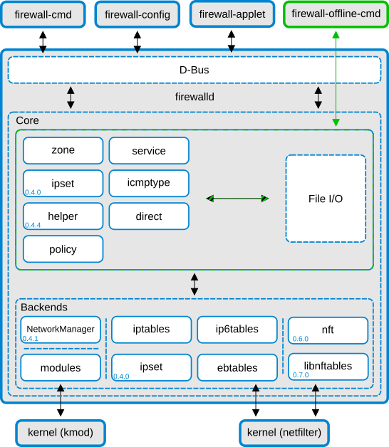

# Linux
[Linux disable firewall command - nixCraft](https://www.cyberciti.biz/faq/linux-disable-firewall-command/)

## iptables
[Wikipedia](https://en.wikipedia.org/wiki/Iptables)

A series of **rules** makes up a **chain**. The kernel reads the chain from top to bottom, using the first rule that matches. A set of chains makes up a **table**.

List all tables:  
`sudo cat /proc/net/ip_tables_names`
```
security  
raw  
nat  
mangle  
filter
```

List all rules:  
`sudo iptables-save`  
or
```sh
su
iptables -vL -t filter
iptables -vL -t nat
iptables -vL -t mangle
iptables -vL -t raw
iptables -vL -t security
```

You'll normally work primarily with a single table named **filter** that controls basic packet flow. There are three basic chains in the filter table:
- INPUT for incoming packets
- OUTPUT for outgoing packets
- FORWARD for routed packets

判断使用的 iptalbes 是否是基于 nftables 的：
```sh
$ iptables -V
iptables v1.8.4 (legacy)
$ iptables -V
iptables v1.8.4 (nf_tables)
```

- Listing

  ```sh
  iptables -nvL
  iptables -t nat -nvL
  ```
  [iptables does not list rules i have created - Unix & Linux Stack Exchange](https://unix.stackexchange.com/questions/1879/iptables-does-not-list-rules-i-have-created)

- Clearing

  [linux - best way to clear all iptables rules - Server Fault](https://serverfault.com/questions/200635/best-way-to-clear-all-iptables-rules)
  ```sh
  iptables -P INPUT ACCEPT
  iptables -P FORWARD ACCEPT
  iptables -P OUTPUT ACCEPT
  iptables -t nat -F
  iptables -t mangle -F
  iptables -F
  iptables -X
  ```

### Persisting rules
```sh
sudo apt install iptables-persistent
```
Any time you modify your rules, run:
```sh
iptables-save > /etc/iptables/rules.v4
ip6tables-save > /etc/iptables/rules.v6
```

[How to save iptables firewall rules permanently on Linux - nixCraft](https://www.cyberciti.biz/faq/how-to-save-iptables-firewall-rules-permanently-on-linux/)

[boot - Why do iptables rules disappear when restarting my Debian system? - Unix & Linux Stack Exchange](https://unix.stackexchange.com/questions/52376/why-do-iptables-rules-disappear-when-restarting-my-debian-system)

[Firewall: Persisting Iptables Rules | Servers for Hackers](https://serversforhackers.com/c/firewall-persisting-iptables-rules)

But why isn't this built-in?
- For history reasons, persistent cannot be the default
  - > Not everybody uses `iptables` program directly. Some people may use wrappers, e.g. `ufw`. In that case, it is better to not to store raw rules, but make a wrapper to generate them from its own persistent config.
  - > Several tools around iptables don't expect its persistence. For example, if you use `fail2ban`, it adds iptables rules when jail starts and removes them when it stops. If you save rules with netfilter-persistent in between, and reboot a host, it'll remember everything that fail2ban did and then, when fail2ban starts, it adds everything again. After several cycles, you'll find your iptables bloated with duplicated fail2ban stuff.

  [ubuntu - Why Does Iptables rules not persisten by default? - Server Fault](https://serverfault.com/questions/1103763/why-does-iptables-rules-not-persisten-by-default)

- But why not add a `--persistent` flag at least? Isn't this much better than `iptables-save` if there are some programs will automatically modify the rules?

### IP sets
```sh
-A CROWDSEC_CHAIN -m set --match-set crowdsec-blacklists-0 src -m comment --comment "CrowdSec: CAPI" -j DROP
```

[linux - How to check multiple list from IPSet in IPTables with a single rule? - Unix & Linux Stack Exchange](https://unix.stackexchange.com/questions/511814/how-to-check-multiple-list-from-ipset-in-iptables-with-a-single-rule)

[Traffic shaping with iptables, ipset and tc (--match-set and --set-mark) - Server Fault](https://serverfault.com/questions/845949/traffic-shaping-with-iptables-ipset-and-tc-match-set-and-set-mark)

## nftables
 [^nft-wiki]

nftables has been available since Linux kernel 3.13 released on 2014-01-19.
- CentOS 8 (2019-09-24)
- Debian 10 (2019-07-06)
	- Ubuntu 21.10 (2021-10-14)

List all rules:  
`nft list ruleset`

[^nft-wiki]: [nftables - Wikipedia](https://en.wikipedia.org/wiki/Nftables)

### Grammar
<!--t28-->
[Man page of NFT](https://www.netfilter.org/projects/nftables/manpage.html)

## CLI
### firewalld
[firewalld - Wikipedia](https://en.wikipedia.org/wiki/Firewalld)



- 为什么 firewalld 添加的 rule 在 iptables 中看不到？  
  因为用的是 nftables。

## Uncomplicated Firewall
[Uncomplicated Firewall - Wikipedia](https://en.wikipedia.org/wiki/Uncomplicated_Firewall)

## Libraries
Rust:
- [yaa110/rust-iptables: Rust bindings for iptables](https://github.com/yaa110/rust-iptables)
- [nftables-rs: Safe abstraction for nftables JSON API (libnftables-json).](https://github.com/namib-project/nftables-rs)

## Android
- 2024-04 [求免root，不影响vpn的安卓防火墙 - 问题求助❓ / 小问答 - 小众软件官方论坛](https://meta.appinn.net/t/topic/55026)