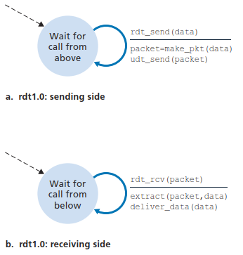
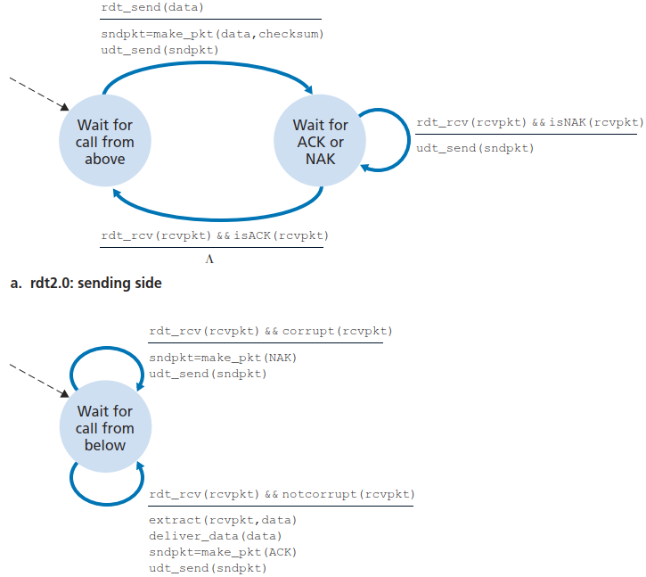

# Reliable Data Transfer
[^topdown]

- 停止等待协议
  
  发送窗口大小 = 1，接收窗口大小 = 1
  
  信道最大利用率：
  $$\frac{\frac{L}{C}}{\frac{L}{C}+2R}$$
  其中 $C$ 为数据传输率， $L$ 为帧长， $R$ 为单程传播时延。
- 后退 N 帧协议
  
  发送窗口大小 > 1，接收窗口大小 = 1

  发送窗口大小 $W_T$：
  $$1\le W_T\le 2^n-1$$
  $n$ 为帧编号的位数。
- 选择重传协议
  
  发送窗口大小 > 1，接收窗口大小 > 1

  发送窗口大小 $W_T$ 和接收窗口大小 $W_R$：
  $$W_R+W_T\le 2^n$$

## RDT over a Perfectly Reliable Channel: rdt1.0

## RDT over a Channel with Bit Errors: rdt2.0

Automatic Repeat reQuest protocol:
- Error detection
- Receiver feedback
  
  e.g. Positive acknowledgment (ACK) and Negative acknowledgment (NAK)
- Retransmission

Stop-and-wait protocol

### rdt2.1
Consider three possibilities for handling corrupted ACKs or NAKs:
- Repeat
- Checksum: does not work for lost ACKs or NAKs
- Resend: duplicate packets → sequence number

### rdt2.2
NAK-free

## RDT over a Lossy Channel with Bit Errors: rdt3.0
There are many possible approaches toward dealing with packet loss. Here, we'll put the burden of detecting and recovering from lost packets on the sender. If the sender is willing to wait long enough (at least as long as RTT) so that it is certain that a packet has been lost, it can simply retransmit the data packet.

Alternating-bit protocol

## Pipelined RDT Protocols
Two basic approaches toward pipelined error recovery can be identified: Go-Back-N and selective repeat.

### Go-Back-N
In a GBN protocol, the sender is allowed to transmit multiple packets without waiting for an acknowledgment, but is constrained to have no more than some maximum allowable number, $N$, of unacknowledged packets in the pipeline.

In our GBN protocol, an acknowledgment for a packet with sequence number $n$ will be taken to be a *cumulative acknowledgment*, indicating that all packets with a sequence number up to and including $n$ have been correctly received at the receiver.

### Selective Repeat

The window size must be less than or equal to half the size of the sequence number space.

[^topdown]: Computer Networking：A Top-Down Approach