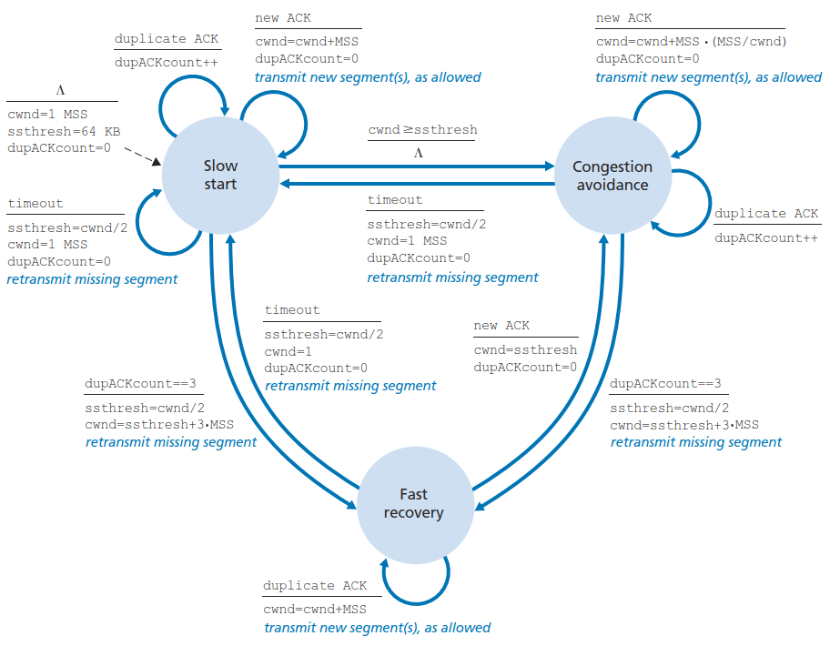
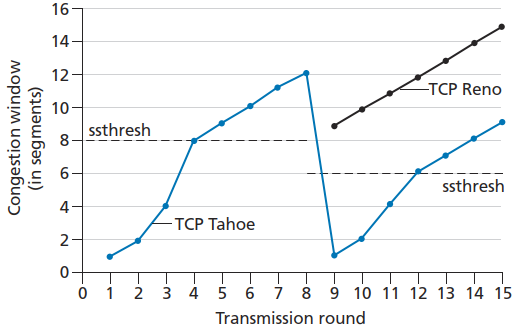

# Congestion Control
- 发送方如何感知拥塞？
  
  端到端拥塞控制：超时 / 接收到 3 个冗余 ACK
- 发送方该按什么算法来决定发送速率的限制？
  
  慢启动、拥塞避免和快速恢复。
- 发送方如何限制发送速率？
  
  Congestion window（拥塞窗口）

  $$LastByteSend-LastByteAcked\le \min{\{cwnd,rwnd\}}$$

## 拥塞控制算法

- cwnd 增加时总是伴随着 segment 的传输
- 当只存在冗余 ACK 形式的丢包时，cwnd 的变化规律为 Additive-Increase, Multiplicative-Decrease（AIMD，加性增、乘性减）

### 慢启动
刚建立连接时，cwnd 的长度为一个 MSS。每当一个 segment 被确认时就增加一个 MSS，以指数形式增长。

当 cwnd 达到 ssthresh（slow start threshold）时，连接会从慢启动转移到拥塞避免状态。

一旦发生超时，ssthresh 会被设为 cwnd 的一半，并将 cwnd 重置为一个 MSS，进行重传。

一旦收到 3 个冗余 ACK，ssthresh 会被设为 cwnd 的一半，并将 cwnd 减半后加上 3 个 MSS，进行重传，再转移到快速恢复状态。

### 拥塞避免
每当收到一个确认时，将 cwnd 增加 $\frac{MSS}{cwnd}\cdot MSS$，即一个 RTT 内增加一个 MSS，以线性形式增长。

一旦发生丢包，与慢启动状态执行相同操作。

### 快速恢复
每当收到一个重复 ACK，将 cwnd 增加一个 MSS。（因为当收到新 ACK 时 cwnd 会被设为 ssthresh，增加的 MSS 只会影响快速恢复状态）

当收到一个新 ACK，将 cwnd 设为 ssthresh，转移到拥塞避免状态。

一旦发生超时，与慢启动状态执行相同操作。

## 吞吐量
$$\begin{align} \\
\text{连接平均吞吐量}
&=\frac{0.75\times W}{RTT} \\
&=\frac{1.22\times MSS}{RTT \sqrt L}
\end{align}$$