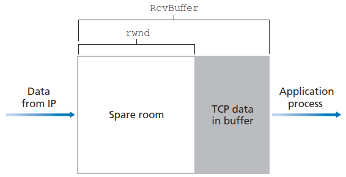
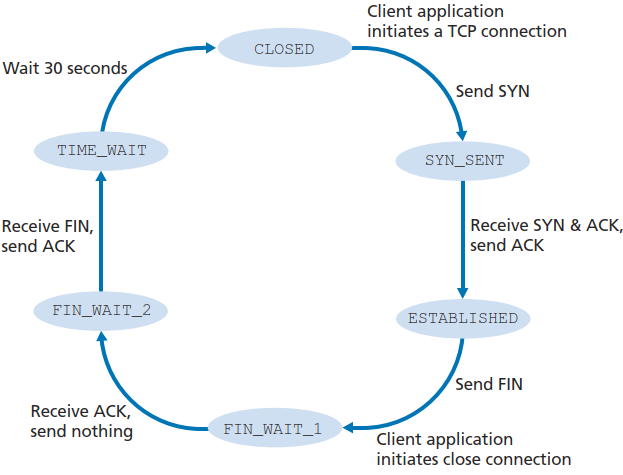

# Transmission Control Protocol (TCP)
**Transmission Control Protocol (TCP)** provides reliable, ordered, and error-checked delivery of a stream of octets (bytes) between applications running on hosts communicating via an IP network.[^wiki]

[TCP 的那些事儿（上） | 酷 壳 - CoolShell](https://coolshell.cn/articles/11564.html)

[TCP 的那些事儿（下） | 酷 壳 - CoolShell](https://coolshell.cn/articles/11609.html)

## Services
- Connection-oriented service
- Reliable data transfer
- Congestion-control

## RFC documents
- [RFC 675](https://datatracker.ietf.org/doc/html/rfc675) – Specification of Internet Transmission Control Program, December 1974 Version
- **[RFC 793](https://datatracker.ietf.org/doc/html/rfc793)** – TCP v4
- [STD 7](https://tools.ietf.org/html/std7) – Transmission Control Protocol, Protocol specification
- [RFC 1122](https://datatracker.ietf.org/doc/html/rfc1122) – includes some error corrections for TCP
- [RFC 1323](https://datatracker.ietf.org/doc/html/rfc1323) – TCP Extensions for High Performance (Obsoleted by RFC 7323)
- [RFC 1379](https://datatracker.ietf.org/doc/html/rfc1379) – Extending TCP for Transactions—Concepts (Obsoleted by RFC 6247)
- [RFC 1948](https://datatracker.ietf.org/doc/html/rfc1948) – Defending Against Sequence Number Attacks
- [RFC 2018](https://datatracker.ietf.org/doc/html/rfc2018) – TCP Selective Acknowledgment Options
- [RFC 3168 - The Addition of Explicit Congestion Notification (ECN) to IP](https://datatracker.ietf.org/doc/html/rfc3168)
- [**RFC 2581** - TCP Congestion Control](https://datatracker.ietf.org/doc/html/rfc2581)
- [RFC 5681](https://datatracker.ietf.org/doc/html/rfc5681) – TCP Congestion Control
- [RFC 6247](https://datatracker.ietf.org/doc/html/rfc6247) – Moving the Undeployed TCP Extensions RFC 1072, RFC 1106, RFC 1110, RFC 1145, RFC 1146, RFC 1379, RFC 1644, and RFC 1693 to Historic Status
- [RFC 6298](https://datatracker.ietf.org/doc/html/rfc6298) – Computing TCP's Retransmission Timer
- [RFC 6824](https://datatracker.ietf.org/doc/html/rfc6824) – TCP Extensions for Multipath Operation with Multiple Addresses
- [RFC 7323](https://datatracker.ietf.org/doc/html/rfc7323) – TCP Extensions for High Performance
- [RFC 7413 - TCP Fast Open](https://datatracker.ietf.org/doc/html/rfc7413)
- [RFC 7414](https://datatracker.ietf.org/doc/html/rfc7414) – A Roadmap for TCP Specification Documents

## Segment structure
[^topdown]
```
 0                   1                   2                   3
 0 1 2 3 4 5 6 7 8 9 0 1 2 3 4 5 6 7 8 9 0 1 2 3 4 5 6 7 8 9 0 1
+-+-+-+-+-+-+-+-+-+-+-+-+-+-+-+-+-+-+-+-+-+-+-+-+-+-+-+-+-+-+-+-+
|          Source Port          |       Destination Port        |
+-+-+-+-+-+-+-+-+-+-+-+-+-+-+-+-+-+-+-+-+-+-+-+-+-+-+-+-+-+-+-+-+
|                        Sequence Number                        |
+-+-+-+-+-+-+-+-+-+-+-+-+-+-+-+-+-+-+-+-+-+-+-+-+-+-+-+-+-+-+-+-+
|                    Acknowledgment Number                      |
+-+-+-+-+-+-+-+-+-+-+-+-+-+-+-+-+-+-+-+-+-+-+-+-+-+-+-+-+-+-+-+-+
|  Data |Reserv-|C|E|U|A|P|R|S|F|                               |
| Offset|  ed   |W|C|R|C|S|S|Y|I|            Window             |
|       |       |R|E|G|K|H|T|N|N|                               |
+-+-+-+-+-+-+-+-+-+-+-+-+-+-+-+-+-+-+-+-+-+-+-+-+-+-+-+-+-+-+-+-+
|           Checksum            |         Urgent Pointer        |
+-+-+-+-+-+-+-+-+-+-+-+-+-+-+-+-+-+-+-+-+-+-+-+-+-+-+-+-+-+-+-+-+
|                    Options                    |    Padding    |
+-+-+-+-+-+-+-+-+-+-+-+-+-+-+-+-+-+-+-+-+-+-+-+-+-+-+-+-+-+-+-+-+
|                             data                              |
+-+-+-+-+-+-+-+-+-+-+-+-+-+-+-+-+-+-+-+-+-+-+-+-+-+-+-+-+-+-+-+-+
```

### Flag field
- RST, SYN, FIN: used for connection setup and teardown
- PSH: the receiver should pass the data to the upper layer immediately
- ACK: the value carried in the acknowledgment field is valid
- URG: there is data in this segment that the sending-side upper-layer entity has marked as “urgent”
  The location of the *last byte* of this urgent data is indicated by the urgent pointer.
- CWR, ECE: used in explicit congestion notification

### Sequence numbers and acknowledgment numbers
The **sequence number** for a segment is the byte-stream number of the first byte in the segment.

Both sides of a TCP connection randomly choose an initial sequence number. This is done to minimize the possibility that a segment that is still present in the network from an earlier, already-terminated connection between two hosts is mistaken for a valid segment in a later connection between these same two hosts (which also happen to be using the same port numbers as the old connection).

The **acknowledgment number** that Host A puts in its segment is the sequence number of the next byte Host A is expecting from Host B.

### Maximum segment size
$$\text{TCP header} + \text{Maximum Segment Size (MSS)} \le \text{Maximum Transmission Unit (MTU)}$$

The length of the TCP header is typically 40 bytes, and both Ethernet and PPP link-layer protocols have an MTU of 1500 bytes, thus a typical value of MSS is 1460 bytes.

## Timeout interval
超时间隔必须大于 RTT，否则会出现不必要的重传，但也不应该大得太多，否则传输延迟会增大。

为了估计 RTT，TCP 会维持一个 SampleRTT 的均值 EstimatedRTT：
$$\text{EstimatedRTT}=(1-\alpha)\cdot\text{EstimatedRTT}+\alpha\cdot\text{SampleRTT}$$
即 exponential weighted moving average（EWMA，指数加权移动平均），其中 $\alpha$ 的推荐值为 $0.125$。

DevRTT 用于估算 SampleRTT 一般会偏离 EstimatedRTT 的程度：
$$\text{DevRTT}=(1-\beta)\cdot\text{DevRTT}+\beta\cdot|\text{SampleRTT}-\text{EstimatedRTT}|$$
$\beta$ 的推荐值为 $0.25$。

超时间隔 TimeoutInterval：
$$\text{TimeoutInterval}=\text{EstimatedRTT}+4\cdot\text{DevRTT}$$
推荐的初始值为 1 秒。当出现超时时 TimeoutInterval 会被加倍，直到收到 segment 并更新 EstimatedRTT。

## RDT
[^topdown]
```c
/* Assume sender is not constrained by TCP flow or congestion control, that data from above is less than MSS in size, and that data transfer is in one direction only. */

NextSeqNum=InitialSeqNumber
SendBase=InitialSeqNumber

loop (forever) {
    switch(event)
        event: data received from application above
            create TCP segment with sequence number NextSeqNum
            if (timer currently not running)
                start timer
            pass segment to IP
            NextSeqNum=NextSeqNum+length(data)
            break;

        event: timer timeout
            retransmit not-yet-acknowledged segment with
                smallest sequence number
            start timer
            break;

        event: ACK received, with ACK field value of y
            if (y > SendBase) {
                SendBase=y
                if (there are currently any not-yet-acknowledged segments)
                    start timer
            }
            else {/* a duplicate ACK for already ACKed segment */
                increment number of duplicate ACKs
                    received for y
                if (number of duplicate ACKS received for y==3)
                   /* TCP fast retransmit */
                   resend segment with sequence number y
            }
            break;

} /* end of loop forever */
```
- 超时时只重传一个 segment。
  
  TCP 既不是 GBN，也不是 SR。
- 超时时间隔加倍，提供了一定程度的拥塞控制。
- 收到 3 个冗余 ACK 时进行快速重传。

## Flow Control
[^topdown]

发送方会维护一个 receive window：
$$\text{rwnd}=\text{RcvBuffer}-(\text{LastByteRcvd}-\text{LastByteRead})$$

通过将未确认的数据量控制在 rwnd 以内，就可以保证接收方的缓存不会溢出：
$$\text{LastByteSent}-\text{LastByteAcked}\le\text{rwnd}$$

## Connection management


三次握手与四次挥手

建立连接：
1. 客户端发送 SYN
  
   使用随机序列号 client_isn
2. 服务端分配 TCP 缓存和变量，发送 SYN-ACK
  
   使用随机序列号 server_isn

   确认号为 client_isn + 1

   （如果服务端不接受连接会发送 RST）
3. 客户端发送 ACK
  
   序列号为 client_isn + 1

   确认号为 server_isn + 1

关闭连接：
1. 一方发送 FIN (`FIN_WAIT1`)，收到 ACK (`FIN_WAIT2`)
2. 另一方（`CLOSE_WAIT`）之后也发送 FIN（`LAST_ACK`），收到 ACK (`TIME_WAIT`, `CLOSED`)

另一方可能同时会将 ACK 和 FIN 合并到一起发送。

- Sequence number randomization

  [tcpip - TCP sequence number randomization - Server Fault](https://serverfault.com/questions/704799/tcp-sequence-number-randomization)

  [Do you know what TCP sequence number randomization is? You better : r/networking](https://www.reddit.com/r/networking/comments/3hac61/do_you_know_what_tcp_sequence_number/)

- 理论上来说谁先发送 FIN 在结果上没有区别
  - 但实践中通常由客户端先发送 FIN，如果是服务端先发送 FIN，有可能会被防火墙误以为客户端在使用无效数据包进行恶意攻击，屏蔽客户端新连接；收到客户端 FIN 较晚，在客户端端口复用的情况下可能会出现问题

    [c++ - Windows TCP connection failures and retransmissions - Stack Overflow](https://stackoverflow.com/questions/64378720/windows-tcp-connection-failures-and-retransmissions)
  - 但如果客户端先发送 FIN，也可能会被 NAT/firewall 过早关闭而无法再与服务端使用同一连接通讯

  [云风的 BLOG: skynet 处理 TCP 连接半关闭问题](https://blog.codingnow.com/2021/02/skynet_tcp_halfclose.html)

  [→Reusing](#reusing)

- [linux - What is it happening if a port is constantly (since one or more days) in `FIN_WAIT1`? - Super User](https://superuser.com/questions/1411397/what-is-it-happening-if-a-port-is-constantly-since-one-or-more-days-in-fin-wai)

  [linux - How do I get rid of sockets in FIN\_WAIT1 state? - Server Fault](https://serverfault.com/questions/7689/how-do-i-get-rid-of-sockets-in-fin-wait1-state)

  [linux下TCP在FIN\_WAIT1状态能持续多久及TCP假连接问题 - 知乎](https://zhuanlan.zhihu.com/p/337662796)

- [tcp - Why are connections in `FIN_WAIT2` state not closed by the Linux kernel? - Server Fault](https://serverfault.com/questions/738300/why-are-connections-in-fin-wait2-state-not-closed-by-the-linux-kernel)

  [大量 FIN\_WAIT2 状态的 TCP 连接不会被切断 - Issue #87 - zhboner/realm](https://github.com/zhboner/realm/issues/87)

  [一个TCP FIN\_WAIT2状态细节引发的感慨\_final wait 2 tcp-CSDN博客](https://blog.csdn.net/dog250/article/details/81256550)
  > tcp_fin_timeout (integer; default: 60; since Linux 2.2)  
  > This specifies how many seconds to wait for a final FIN packet before the socket is forcibly closed. This is  
  > strictly a violation of the TCP specification, but required to prevent denial-of-service attacks. In Linux 2.2,  
  > the default value was 180.

  > 连接在FINWAIT-2超时后并不会进入TIMEWAIT状态，也不会发送reset，而是直接默默消失。

  [网络分析流量FIN\_WAIT\_2状态解释\_fin-wait-2-CSDN博客](https://blog.csdn.net/ximenjianxue/article/details/117735333)
  > 但是除此之外，如果应用层是执行shutdown（SHUT_WR）操作关闭了套接口的发送，TCP连接还可进行接收操作，此种情况下的TCP连接处于FIN_WAIT_2状态不受tcp_fin_timeout的时间限制，将会永久的等待对端去关闭连接或者本地使用close关闭或者重启OS。

  [Oracle Commerce Guided Search - Configuring `FIN_WAIT_2` timeout on Windows](https://docs.oracle.com/cd/E70265_01/common.11-3/EndecaperfTuning/html/tperf_configuring_socket_timeout_on_windows.xmltask_2014678A9AE64628B2A4A7F31BC3BA5F.html)
  > The Registry entry that controls this setting is `HKEY_LOCAL_MACHINE\SYSTEM\CurrentControlSet\Services\Tcpip\Parameters`. You need to specify the `TcpFinWait2Delay` value for the above entry in the registry. The default value is 240s.
  > 
  > Restart your system for the change to take effect.

- Maximum segment lifetime ([Wikipedia](https://en.wikipedia.org/wiki/Maximum_segment_lifetime))

  > The specification calls for this value to be used for the "time-wait" interval, the minimum time a system must keep the socket in the `TIME_WAIT` *state* before designating the socket closed, thus preventing the socket from being re-used before that interval.

  > In Linux, the time-wait interval is defined by the `TCP_TIMEWAIT_LEN`, hard-coded as 60 seconds. Linux implements several possible optimizations to shorten the `TIME_WAIT` state through *recycling*, down to a minimum of 3.5s in recent kernels.

  Windows: [TcpTimedWaitDelay](https://learn.microsoft.com/en-us/biztalk/technical-guides/settings-that-can-be-modified-to-improve-network-performance#adjust-the-maxuserport-and-tcptimedwaitdelay-settings), 120 by default

  NAT 可能会在十几秒内复用端口。

  [network protocols - Setting TIME\_WAIT TCP - Stack Overflow](https://stackoverflow.com/questions/337115/setting-time-wait-tcp)

[netstat(8) - Linux man page](https://linux.die.net/man/8/netstat)
- State

  [c++ - Socket programming, what about `CLOSE_WAIT`, `FIN_WAIT_2` and `LISTENING`? - Stack Overflow](https://stackoverflow.com/questions/27820811/socket-programming-what-about-close-wait-fin-wait-2-and-listening)

[c - Is there a way to detect that TCP socket has been closed by the remote peer, without reading from it? - Stack Overflow](https://stackoverflow.com/questions/17705239/is-there-a-way-to-detect-that-tcp-socket-has-been-closed-by-the-remote-peer-wit)

### Keepalive
[Wikipedia](https://en.wikipedia.org/wiki/Keepalive#TCP_keepalive)

尽管关闭接收与否本身不会发送消息，但不关闭接收时会发送 keepalive，实际上是一种基于时间的，默认不关闭接收的协议。

[network programming - Does TCP endpoint that has sent a FIN, still send keepalive? - Stack Overflow](https://stackoverflow.com/questions/18110239/does-tcp-endpoint-that-has-sent-a-fin-still-send-keepalive)
> Keep-alive packets MUST only be sent when no data or acknowledgement packets have been received for the connection within an interval.

### Reusing
[linux - `tcp_tw_reuse` vs `tcp_tw_recycle` : Which to use (or both)? - Stack Overflow](https://stackoverflow.com/questions/6426253/tcp-tw-reuse-vs-tcp-tw-recycle-which-to-use-or-both)

[Linux `tcp_tw_reuse = 2` --- how is this set and what is the significance? - General questions - VyOS Forums](https://forum.vyos.io/t/linux-tcp-tw-reuse-2-how-is-this-set-and-what-is-the-significance/5286)

[linux - Why is `tcp_tw_reuse` turned off by default? - Stack Overflow](https://stackoverflow.com/questions/10937828/why-is-tcp-tw-reuse-turned-off-by-default)

Windows:
- [TcpTimedWaitDelay | Microsoft 学习 --- TcpTimedWaitDelay | Microsoft Learn](https://learn.microsoft.com/en-us/previous-versions/windows/it-pro/windows-2000-server/cc938217(v=technet.10)?redirectedfrom=MSDN)

[windows - What are `CLOSE_WAIT` and `TIME_WAIT` states? - Super User](https://superuser.com/questions/173535/what-are-close-wait-and-time-wait-states)

[Does Windows support tcp `TIME_WAIT` reuse? - Server Fault](https://serverfault.com/questions/760076/does-windows-support-tcp-time-wait-reuse)

[TCP 的那些事儿（上） | 酷 壳 - CoolShell](https://coolshell.cn/articles/11564.html)
> 如果是tcp_tw_recycle被打开了话，会假设对端开启了tcp_timestamps，然后会去比较时间戳，如果时间戳变大了，就可以重用。但是，如果对端是一个NAT网络的话（如：一个公司只用一个IP出公网）或是对端的IP被另一台重用了，这个事就复杂了。建链接的SYN可能就被直接丢掉了（你可能会看到connection time out的错误）

[NAT网络下TCP连接建立时可能SYN包被服务器忽略-tcp\_tw\_recycle | 趁着年轻](http://chenzhenianqing.com/articles/1150.html)

[从Nat到TCP\_TW - Code Life](https://vsxen.github.io/2020/02/25/tcp_nat/)

### Connection limit
[TCP/IP concurrent connections - Microsoft Q&A](https://learn.microsoft.com/en-us/answers/questions/482793/tcp-ip-concurrent-connections)

[How to set to allow MaximumTCP connection in windows server 2016 - Microsoft Q&A](https://learn.microsoft.com/en-us/answers/questions/495615/how-to-set-to-allow-maximumtcp-connection-in-windo)

[asp.net mvc - Windows 10 Maximum TCP-IP Connection Limit - Stack Overflow](https://stackoverflow.com/questions/38832351/windows-10-maximum-tcp-ip-connection-limit)

## 粘包
> TCP 是基于字节流的协议
> 你发两次数据，比如 {1, 2} 和 {3, 4}
> 客户端一定会收到 1, 2, 3, 4
> 但是可能是 {1, 2}{3, 4}，可能是 {1}{2, 3, 4}，可能是 {1, 2, 3, 4}
> 分包就是为了防止粘到一起 或者被割开

[怎么解决TCP网络传输「粘包」问题？ - 知乎](https://www.zhihu.com/question/20210025)

[TCP 粘包？ 到底有没有粘包？ - V2EX](https://www.v2ex.com/t/1067508#reply27)

不过 TCP 断开连接时有通知，如果每条消息都使用独立连接，也可以将 TCP 用作基于包的协议，尽管开销很大。 

## Performance
[TCP/IP performance known issues - Windows Server | Microsoft Learn](https://learn.microsoft.com/en-us/troubleshoot/windows-server/networking/tcpip-performance-known-issues)

[Regedit Tweaks For Better Network Speed? : r/pcmasterrace](https://www.reddit.com/r/pcmasterrace/comments/140kh2n/regedit_tweaks_for_better_network_speed/)

## Fingerprinting
[Wikipedia](https://en.wikipedia.org/wiki/TCP/IP_stack_fingerprinting)

## Tools
- Wireshark

  [7.5. TCP Analysis](https://www.wireshark.org/docs/wsug_html_chunked/ChAdvTCPAnalysis.html)
  - TCP conversation completeness

- Windows
  - Resource Monitor

[windows - Open a test TCP connection to a specified IP/Port - Super User](https://superuser.com/questions/392509/open-a-test-tcp-connection-to-a-specified-ip-port)


[^wiki]: [Transmission Control Protocol - Wikipedia](https://en.wikipedia.org/wiki/Transmission_Control_Protocol)
[^topdown]: Computer Networking：A Top-Down Approach